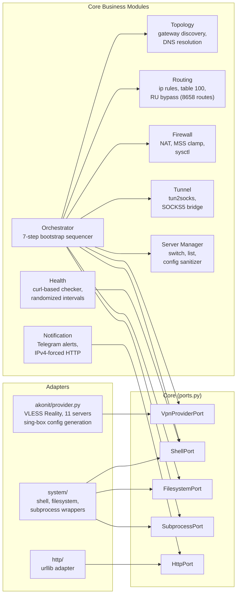
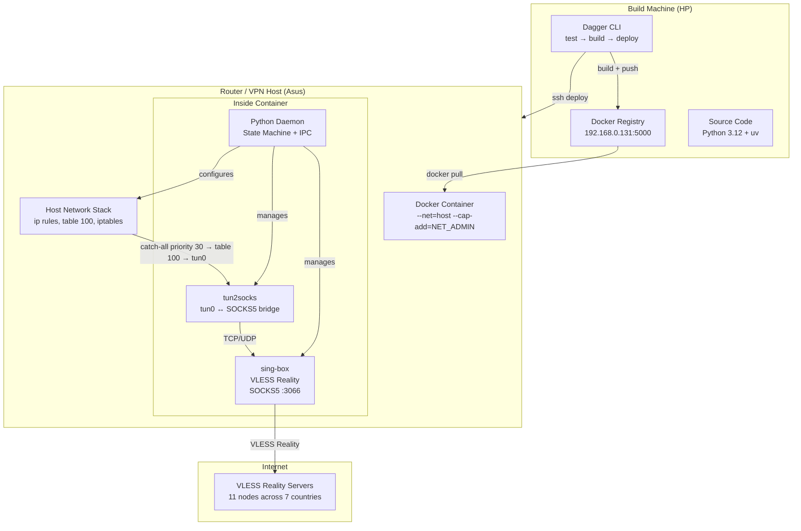
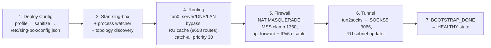
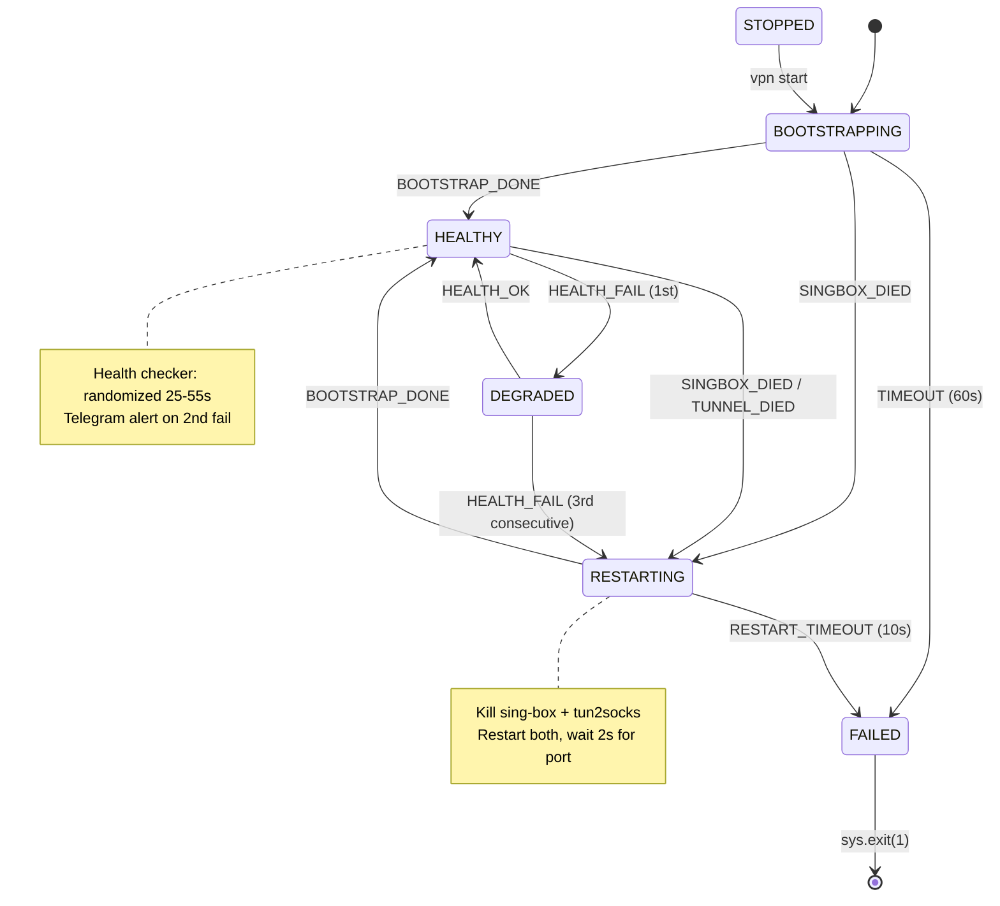
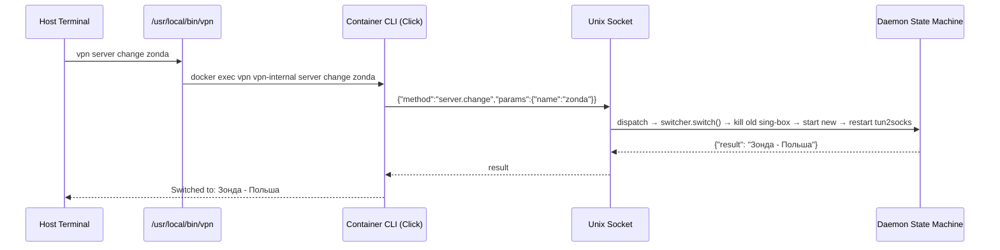
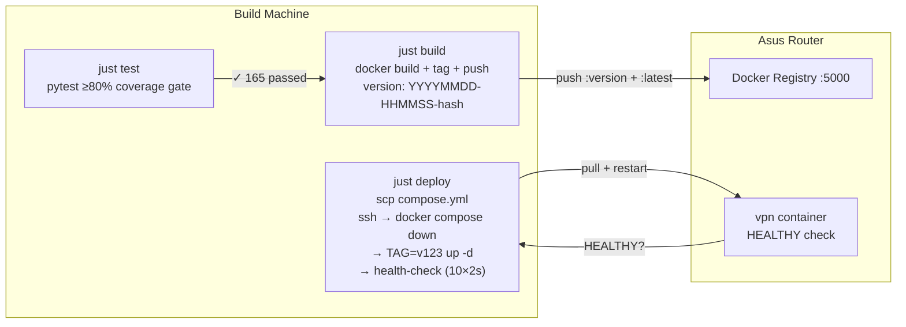

<div align="center">

# Virtual Private Network — Self-Healing Docker Orchestrator

### *From 934 lines of spaghetti to hexagonal event-driven architecture with Dagger CI/CD.*

A VPN daemon that survives crashes, switches servers in seconds, and deploys with a single command — no GitHub, no cloud, no manual ssh.

<br/>

<!-- ═══════════════════════ TECH STACK ═══════════════════════ -->


<br/>

<!-- ═══════════════════════ VITALS ═══════════════════════ -->


<br/>

<b>
<a href="#-the-problem">Problem</a> ·
<a href="#-architecture">Architecture</a> ·
<a href="#-state-machine">State Machine</a> ·
<a href="#-project-structure">Structure</a> ·
<a href="#-cicd-pipeline">CI/CD</a> ·
<a href="#-quick-start">Quick Start</a> ·
<a href="#-cli-reference">CLI</a>
</b>

</div>

<br/>

---

> ***Legenda*** The old VPN daemon was 934 lines of hardcoded spaghetti: secrets in source, `while True: sleep; check; if fail` watchdog, no provider abstraction, no tests. Every change risked breaking production. So we threw it away and rebuilt from scratch — hexagonal architecture, event-driven state machine, full test suite, and a CI/CD pipeline that deploys with one command.

---

<br>

## 🎯 The Problem

<div align="center">
<table>
<tr>
<td width="50%" align="center">

### 🔥 What We Had

**934-line `vpn_daemon.py`. Secrets in source. `time.sleep()` watchdog. Zero tests.**

Every new idea → rewrite from scratch → more variants → chaos.

Multiple versions of the same daemon lying around: `vpn_daemon.py`, `vpn-hiddify-28-05-2026/`, `vless_updater.py`, `gemini_check_vpn.py`, `dadya_vanya.py`...

</td>
<td width="50%" align="center">

### 🏗️ What We Built

| Requirement | Implementation |
|---|---|
| 🔌 Provider-agnostic | Hexagonal Ports & Adapters |
| 🔄 Self-healing | Event-driven state machine (6 states) |
| 🧪 Tested | 165 tests, ≥80% coverage gate |
| 🚀 One-command deploy | Dagger CI/CD → Docker Registry → Asus |
| 🛑 Fail-closed | Per-state timeouts, crash-guarded bootstrap |
| 📡 Full observability | Structured logging, syslog over TCP |
| 🔧 Runtime control | JSON-RPC CLI over Unix socket |
| 🏷️ Versioned | `YYYYMMDD-HHMMSS-<hash>` immutable images |

</td>
</tr>
</table>
</div>

<br>

## 🏗️ Architecture

### Hexagonal Core — Provider-Agnostic by Design

The core knows nothing about "Akonit", "sing-box", or any VPN provider. It defines **Ports** (Protocol interfaces). Adapters implement them. Switching providers means writing a new adapter — zero changes to core.



### Runtime Topology



### 7-Step Bootstrap Sequence



<br>

## 🔄 State Machine

6 states. Asyncio event-driven. No polling. No `while True: sleep`.



### Per-State Timeouts

Every state sets an `asyncio.Task` timeout on entry. If the expected event never arrives, the state machine transitions to FAILED — no silent hangs.

| State | Timeout | On Expiry |
|---|---|---|
| BOOTSTRAPPING | 60s | → FAILED |
| RESTARTING | 10s | → FAILED |
| DEGRADED | — | Wait for next health check |
| HEALTHY | — | Idle, waits for events |

<br>

## 🔧 CLI over JSON-RPC

CLI runs inside the container, accessible from the host via a shell wrapper:

```bash
# /usr/local/bin/vpn on Asus host
exec docker exec -i vpn vpn-internal "$@"
```

Communication: **JSON-RPC 2.0 over Unix socket** (`/var/run/vpn.sock`). No HTTP, no ports, no auth — local IPC only.



<br>

## 🚀 CI/CD Pipeline

**Zero cloud dependencies.** Local Docker Registry on the router. Python pipeline script orchestrated via `just`.

```
$ just pipeline
```



### Versioning

`YYYYMMDD-HHMMSS-<7-char git hash>` — immutable, traceable, zero-config.

```bash
$ just build
20260725-183000-abc1234   ← printed + tagged + pushed

# Rollback to previous build:
$ ssh asus "cd /opt/vpn && TAG=20260725-120000-def5678 docker compose up -d"
```

### justfile commands

| Command | What it does |
|---|---|
| `just test` | Local pytest (fast, no Docker) |
| `just test-container` | Containerized pytest via Dagger SDK |
| `just build` | Docker build + push to asus:5000 with version tag |
| `just deploy VERSION` | SSH deploy with health-check |
| `just pipeline` | test-container → build → deploy (full CI/CD) |
<br>

## 📂 Project Structure

```
vpn/
├── 📄 README.md                          ← YOU ARE HERE
├── 📄 pyproject.toml                     ← Python project: Click, pytest, Dagger deps
├── 📄 justfile                           ← Task runner: test/build/deploy/pipeline
├── 📄 compose.yml                        ← Docker Compose: host network, NET_ADMIN, tun device
├── 📄 Dockerfile                         ← Python 3.12-slim + sing-box + tun2socks
├── 📄 .env.example                       ← Secrets template
│
├── 🐍 src/vpn/                           ← PYTHON SOURCE (3651 lines)
│   ├── __main__.py                       ← Entry point: wire adapters → state machine → asyncio.run()
│   │
│   ├── config/                           ← Config SSOT (YAML → frozen dataclasses)
│   │   ├── paths.py                      ← PROJECT_ROOT discovery (3-tier fallback)
│   │   ├── config_loader.py              ← @cache facade
│   │   └── core/                         ← App, Network, Health, Tunnel, Notification,
│   │                                       Servers, Bypass, VpnRoutes configs
│   │
│   ├── core/                             ← HEXAGONAL CORE
│   │   ├── ports.py                      ← ALL Protocol interfaces (Shell, FS, Subprocess, Http, VpnProvider)
│   │   ├── events.py                     ← EventType enum + VpnEvent dataclass
│   │   ├── orchestrator.py               ← 7-step bootstrap sequencer (~180 lines)
│   │   │
│   │   ├── state_machine/                ← EVENT-DRIVEN STATE MACHINE
│   │   │   ├── machine.py                ← VpnStateMachine: event queue, transitions, IPC server
│   │   │   ├── context.py                ← RuntimeContext: gateway, singbox handle, fail streak, route_ips
│   │   │   └── states/
│   │   │       ├── bootstrapping.py      ← Config deploy → topology → routing → firewall → tunnel
│   │   │       ├── healthy.py            ← Health checker running, tunnel operational
│   │   │       ├── degraded.py           ← Health failing, notifying Telegram
│   │   │       ├── restarting.py         ← Kill + restart sing-box + tun2socks
│   │   │       ├── failed.py             ← Final Telegram alert → sys.exit(1)
│   │   │       └── stopped.py            ← Clean shutdown, traffic goes direct
│   │   │
│   │   ├── topology/                     ← Network discovery + DNS resolution
│   │   ├── routing/                      ← ip rules, policy routing, RU bypass (8658 routes)
│   │   ├── firewall/                     ← NAT MASQUERADE, MSS clamp, sysctl
│   │   ├── tunnel/                       ← tun2socks process management
│   │   ├── health/                       ← Curl-based connectivity checker
│   │   ├── notification/                 ← Telegram alerts (IPv4-forced)
│   │   ├── server_manager/               ← Server switching, sing-box config deploy/sanitize
│   │   └── ru_updater/                   ← Background task: fetch RU IPv4 subnets every 24h
│   │
│   ├── cli/                              ← CLI (Click + JSON-RPC over Unix socket)
│   │   ├── main.py                       ← Click group: server, status, bypass, route, stop, start
│   │   └── ipc.py                        ← JSON-RPC client → /var/run/vpn.sock
│   │
│   ├── adapters/                         ← PORT IMPLEMENTATIONS
│   │   ├── akonit/provider.py            ← VpnProviderPort: 11 VLESS Reality servers, sing-box config,
│   │   │                                     emoji tag normalization, remote→local rule_set conversion
│   │   ├── system/                       ← ShellPort, FilesystemPort, SubprocessPort
│   │   └── http/                         ← HttpPort (urllib)
│   │
│   └── logger/                           ← Structured logging (scoped "vpn", propagate=False)
│
├── 🧪 tests/                             ← TEST SUITE (165 tests, ≥80% coverage)
│   ├── test_akonit_provider.py           ← Emoji normalization, config generation, sanitizer
│   ├── test_state_machine.py             ← All 6 states, transitions, IPC dispatch
│   ├── test_cli.py                       ← Click commands, JSON-RPC integration
│   ├── test_orchestrator.py              ← Bootstrap sequencer
│   ├── test_routing.py                   ← RuleManager, RouteTable, TunInterface
│   └── ... (10 more test files)
│
├── ⚙️ config/                            ← YAML CONFIGURATION
│   ├── app.yaml                          ← Provider, table_id, service names
│   ├── servers.yaml                      ← 11 servers (name → outbound tag)
│   ├── network.yaml                      ← tun0 IP/MTU, DNS servers, LAN subnets
│   ├── health.yaml                       ← Health check targets, intervals, thresholds
│   ├── tunnel.yaml                       ← SOCKS5 proxy settings
│   ├── notification.yaml                 ← Telegram event templates
│   ├── bypass.yaml                       ← Domains/subnets bypassing VPN
│   └── vpn-routes.yaml                   ← Domains/wildcards/subnets forced through VPN
│
├── 📦 data/                              ← STATIC DATA
│   ├── profile_keys_akonit_24_07_2026.json  ← VLESS Reality profile (11 outbounds)
│   ├── geoip-ru.srs                      ← Pre-cached Russian IP rule set
│   ├── geosite-ru.srs                    ← Pre-cached Russian domain rule set
│   └── tun2socks                         ← Statically-linked tun2socks binary
│
├── 🚀 ci/                                ← CI/CD PIPELINE
│   └── main.py                           ← Dagger pipeline: test() → build() → deploy()
│
├── 📋 docs/                              ← DOCUMENTATION
│   ├── plans/                            ← Architecture plans (Phase 0–13)
│   └── how-grilling-changed-the-way-ai-wrote-plans.md  ← ADR-012: AI-assisted planning
│
└── 🔒 .github/workflows/                 ← GitHub Actions (optional, offline-first)
    ├── ci.yml                            ← pytest + docker build + smoke tests
    └── security.yml                      ← Trivy vulnerability scan
```

<br>

## 🛡️ Key Design Decisions

### 1. Emoji Tag Normalization

Akonit profile tags carry emoji suffixes (`🧠 ✂️`, `(Без рекламы) ✂️`) that change between profile updates. `servers.yaml` uses human-readable aliases. The solution: `_normalize_tag()` strips all emoji via regex, normalizes both sides of every comparison. Server switching works for all 11 servers, regardless of emoji-version drift.

### 2. `copy.deepcopy` — Protected Profile Cache

`_load_profile()` caches the profile JSON in memory. `sanitize_config()` mutates it in-place. Without `copy.deepcopy()`, the second `server.change` operates on the already-mutated dict where `urltest_out` references are gone. Fix: `build_singbox_config()` deep-copies before modifying.

### 3. `stderr=None` — Visible Errors

Original subprocess adapter set `stderr=subprocess.DEVNULL`. sing-box crashes were invisible — zombie processes, no logs. Changed to `stderr=None` (inherit parent). Every sing-box `FATAL` now appears in Docker logs.

### 4. Offline-First CI/CD

No GitHub Actions, no cloud builders. Dagger runs locally, pushes to a Docker Registry on the router. The pipeline works even with VPN down — the only network dependency is `python:3.12-slim` base image (cached after first pull).

<br>

## 📋 CLI Reference

| Command | What it does |
|---|---|
| `vpn server list` | Table: name, country, host, port (11 servers) |
| `vpn server current` | Active server name |
| `vpn server change <name>` | Switch to barguzin/zonda/gregal/... — restarts sing-box + tun2socks |
| `vpn status` | Gateway, interface, tun0 state, uptime |
| `vpn restart` | Force state machine RESTARTING transition |
| `vpn stop` | Kill all processes, remove ip rules, flush table 100, clean firewall. Traffic goes direct. |
| `vpn start` | Idempotent bootstrap: mini-reset + full 7-step sequence |
| `vpn bypass add --domain <d>` | Add domain to VPN bypass list + instant ip rule |
| `vpn bypass remove --domain <d>` | Remove domain from bypass |
| `vpn bypass list` | Show current bypass domains |
| `vpn route add --domain <d>` | Force domain through VPN tunnel (DNS resolved on daemon) |
| `vpn route add --subnet <cidr>` | Force subnet through VPN |
| `vpn route add --wildcard <p>` | Wildcard pattern (applied on next restart) |
| `vpn route remove --domain <d>` | Remove from forced-VPN list + ip route |
| `vpn route list` | Show all forced-VPN entries |

<br>

## 🚦 Quick Start

### Prerequisites

- Python 3.12+, Docker, [uv](https://docs.astral.sh/uv/)
- Asus router with Docker and local registry on port 5000
- `sing-box` VLESS Reality profile in `data/`

### Local Development

```bash
git clone <repo>
cd vpn
uv sync --dev

# Run tests
just test

# Build Docker image
just build

# Full pipeline: test → build → deploy
just pipeline
```

### Deploy to Asus

```bash
# One command — builds, pushes to Asus registry, deploys with health-check
just pipeline

# Or step by step:
just test                    # pytest ≥80% coverage
just build                   # docker build + push to asus:5000
just deploy 20260725-183000-abc1234  # ssh → pull → restart → HEALTHY check
```

### Running on Asus

```bash
# Check status
vpn status

# List all 11 VPN servers
vpn server list

# Switch to Netherlands
vpn server change gregal

# Verify IP changed
curl -s ifconfig.me/ip

# Stop VPN (traffic goes direct)
vpn stop

# Start again
vpn start
```

<br>

## 📊 Performance

| Metric | Value |
|---|---|
| Bootstrap time | ~1.2 seconds |
| Server switch | <3 seconds |
| SOCKS5 latency | ~50ms idle |
| RU bypass routes | 8,658 subnets |
| Docker image size | ~250 MB |
| Memory footprint | ~60 MB (daemon + sing-box + tun2socks) |

<br>

## 🙏 Acknowledgments

- **[sing-box](https://github.com/SagerNet/sing-box)** — Universal proxy platform
- **[tun2socks](https://github.com/xjasonlyu/tun2socks)** — Layer 3 tunnel to SOCKS5 bridge
- **[Dagger](https://dagger.io/)** — CI/CD as code
- **[Matt Pocock's grilling skill](https://github.com/mattpocock/skills)** — Adversarial architecture review methodology
- **AI-assisted development** — Three-party consilium: architect + griller AI + sysadmin AI (see [ADR-012](docs/how-grilling-changed-the-way-ai-wrote-plans.md))

<br>

<div align="center">

### *Built with hexagonal architecture, tested with 165 tests, deployed with Dagger.*

</div>
