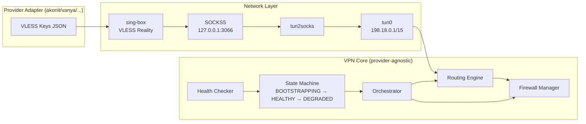
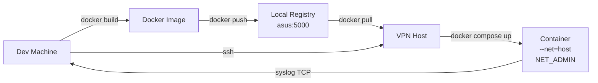
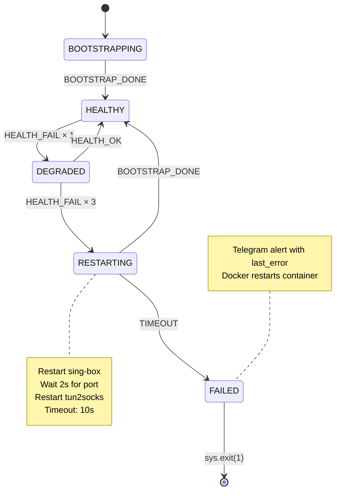

# 🛡️ VPN Orchestrator

[](https://github.com/stan-buren/vpn/actions/workflows/ci.yml)


**Event-driven sing-box VPN daemon with tun2socks bridging, hexagonal architecture, and provider-agnostic core.**

---

## Architecture



## Deploy Topology



## Quick Start

```bash
# Clone
git clone <repo-url>
cd vpn

# Build
docker build -t vpn:latest .

# Deploy (requires SSH access to VPN host)
just deploy 20260725-001
```

## CLI Reference

| Command | Description |
|---|---|
| `vpn server list` | List all 11 available VPN servers |
| `vpn server current` | Show currently active server |
| `vpn server change --name <name>` | Switch to a different server |
| `vpn status` | Show daemon status, gateway, tunnel state |
| `vpn logs` | View recent logs |
| `vpn bypass list` | Show current VPN bypass domains |
| `vpn bypass add --domain <domain>` | Add domain to bypass list |
| `vpn bypass remove --domain <domain>` | Remove domain from bypass list |
| `vpn restart` | Force full daemon restart |
| `vpn emergency-reset` | Wipe all rules, routes, tun0 |

## Configuration

All configuration lives in `config/*.yaml`. No hardcoded values in code.

| File | Purpose |
|---|---|
| `config/app.yaml` | Daemon tag, routing table ID, provider name |
| `config/network.yaml` | tun0 settings, DNS servers, LAN subnets, MSS |
| `config/health.yaml` | Health check targets, intervals, fail thresholds |
| `config/tunnel.yaml` | SOCKS5 proxy host/port, optional MacBook proxy |
| `config/notification.yaml` | Telegram event templates and retry settings |
| `config/servers.yaml` | CLI name → provider tag mapping (11 servers) |
| `config/bypass.yaml` | Domains/subnets to bypass the VPN |
| `config/vpn-routes.yaml` | Domains/wildcards/subnets forced through VPN |
| `config/paths.yaml` | Filesystem paths (all relative to project root) |

Secrets (Telegram token, chat ID) go in `.env` — never in YAML.

## State Machine



## Adding a New VPN Provider

1. Create `src/vpn/adapters/<provider>/provider.py`
2. Implement `VpnProviderPort` (defined in `src/vpn/core/ports.py`):
   - `list_servers() -> list[ServerInfo]`
   - `get_server(name) -> ServerInfo`
   - `build_singbox_config(server_name) -> str`
   - `sanitize_config(raw) -> dict`
3. Create `config/servers.yaml` registry for the new provider's servers
4. Change `provider: <name>` in `config/app.yaml`

Zero changes to core code.

---

**License:** Apache 2.0
