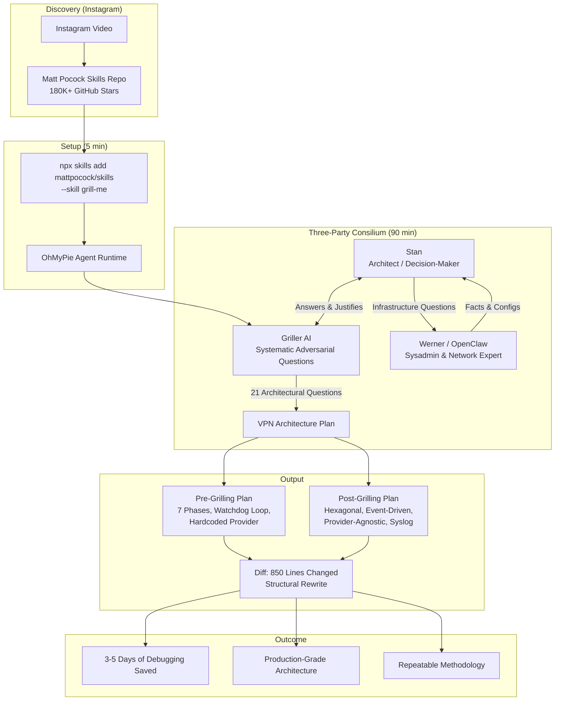
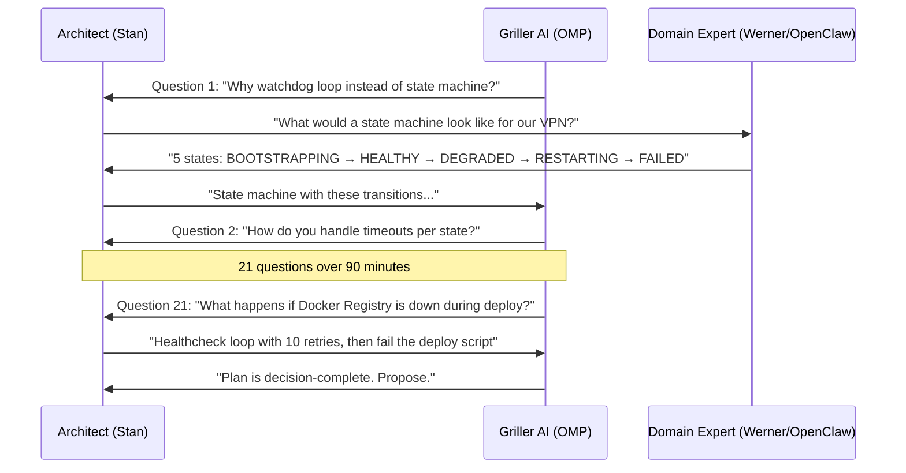

# ADR-012: AI-Assisted Architecture Planning — The Grilling Methodology

## Metadata

**Status:** Accepted
**Version/Date:** v1.0 / 2026-07-25

## Title

AI-Assisted Architecture Planning: How a Grilling Session Transformed a Garbage Draft Into a Production-Grade Design in 90 Minutes

## Description

A 90-minute adversarial Q&A session with an AI "griller" skill transformed a naive phase-based VPN architecture plan (934-line watchdog loop, hardcoded provider, file-based logging) into a hexagonal event-driven design with provider-agnostic ports, a 5-state asyncio machine, and syslog observability. The methodology saved an estimated 3–5 days of debugging and revealed a fundamental truth: the API key is worthless without the surrounding tooling ecosystem.

## Context

On 2026-07-24, the VPN orchestrator rewrite reached its first complete draft — a 533-line plan organized as 7 sequential phases. The plan was structurally correct but architecturally naive: a `while True: sleep; check; if fail` watchdog loop, hardcoded Akonit provider references in every module, file-based logging, and no abstraction for switching VPN providers.

The plan felt "done." It was not.

Earlier that day, an Instagram video mentioned a skill called "grilling" from Matt Pocock's skills repository (180K+ GitHub stars). The skill deploys an AI agent that relentlessly cross-examines a plan through adversarial questioning — one question at a time, forcing the architect to justify every decision. The author installed it via `npx skills@latest add mattpocock/skills --skill grill-me` and ran it against the VPN plan inside OhMyPie (OMP).

What followed was a 90-minute "consilium": three participants — Stan (the architect), OMP running the grilling skill (the interrogator), and Werner/OpenClaw (the sysadmin, answering infrastructure-specific questions). The griller asked 21 architectural questions. Each answer forced a decision. Each decision reshaped the plan.

The result was not a patched v2. It was a structural rewrite: the old plan's 7 phases collapsed into a hexagonal architecture document with event-driven state machine, provider ports, per-state timeouts, and a deploy pipeline with local Docker registry and syslog over TCP. The old plan would have produced garbage. The new plan is production-grade.

## Decision Drivers

- **Architectural quality:** The old plan's watchdog-loop pattern had no timeout protection, no state modeling, and no provider abstraction. A direct implementation would have produced unmaintainable spaghetti.
- **Time ROI:** 90 minutes of grilling versus 3–5 days of debugging a bad architecture in production. The math is unambiguous.
- **Skill ecosystem discovery:** The grilling skill was unknown 24 hours earlier. Its impact proves that the AI tooling ecosystem (skills, MCP servers, RAG, Obsidian vaults) matters more than the model's raw intelligence.
- **Methodology replication:** The three-party consilium pattern (architect + griller AI + domain-expert AI) is a repeatable workflow for any architectural decision, not just VPN.
- **Cost efficiency:** The entire session ran on DeepSeek V4 Pro ($1.74/M input tokens) — a fraction of GPT-5.5 or Claude costs — yet produced architectural quality exceeding what most teams achieve with expensive models and no methodology.

## Alternatives

- **A: Implement the old plan directly** — Start coding from the 7-phase watchdog-loop plan without adversarial review.
  - Pros: Zero planning overhead, immediate coding gratification.
  - Cons: Hardcoded provider, no timeout protection, file-based logging, no state machine. Estimated 3–5 days of production debugging. Would have been "garbage" (author's own assessment).
- **B: Manual peer review** — Ask a colleague to review the plan.
  - Pros: Human intuition, contextual understanding.
  - Cons: No colleague available with both VPN/networking and Python architecture expertise. Takes hours of their time. Inconsistent questioning — humans get tired, skip edge cases, or avoid confrontation.
- **C: Grilling skill adversarial review (CHOSEN)** — Deploy the Matt Pocock grilling skill via OMP.
  - Pros: Relentless, systematic questioning. 21 architectural decisions forced in 90 minutes. Zero fatigue. Questions cover state management, logging, deployment, provider abstraction, timeout handling — categories a human reviewer would miss. Free and open-source.
  - Cons: Requires OMP or compatible agent runtime. Skill installation is a one-time setup cost (~5 minutes). The griller can be overly aggressive — requires the architect to know when to push back.

### Decision Framework

| Model / Option                | Architectural Quality (40%) | Time Efficiency (30%) | Repeatability (20%) | Cost (10%) | Total Score | Decision         |
| ----------------------------- | --------------------------- | --------------------- | ------------------- | ---------- | ----------- | ---------------- |
| **C: Grilling Skill**         | 9.5                         | 8.5                   | 10.0                | 10.0       | **9.3**     | ✅ **Selected**   |
| B: Manual Peer Review         | 6.0                         | 4.0                   | 3.0                 | 5.0        | 5.0         | Rejected         |
| A: Implement Old Plan         | 2.0                         | 2.0                   | 1.0                 | 8.0        | 2.4         | Rejected         |

## Decision

We adopt the **AI grilling methodology** as a mandatory gate for all non-trivial architectural plans. Before any implementation begins, the plan must survive a grilling session that produces at least one structural rewrite (diff ≥ 30% of the document). The methodology uses the Matt Pocock `grill-me` skill deployed inside OhMyPie, with optional domain-expert AI (OpenClaw, Claude Code, or equivalent) participating as a third-party consultant for infrastructure-specific questions.

The grilling session must produce a documented before/after comparison (two ADR files: pre-grilling and post-grilling) showing the architectural decisions forced by the adversarial review.

## High-Level Architecture



## Related Requirements

### Functional Requirements

- **FR-1:** The grilling session must produce a before/after plan comparison with structural diffs ≥ 30% of the original document.
- **FR-2:** The architect must answer every question the griller asks — or explicitly reject it with justification.
- **FR-3:** Domain-expert AI (sysadmin, DBA, network engineer) must be available as a third-party consultant during the session.

### Non-Functional Requirements

- **NFR-1:** **(Methodology Repeatability)** The grilling workflow must be executable by any engineer with OMP installed and the skill repository accessible.
- **NFR-2:** **(Cost Efficiency)** The entire session (griller + domain expert + architect's model) must cost under $2 in API fees. DeepSeek V4 Pro satisfies this at $1.74/M input tokens.
- **NFR-3:** **(Documentation)** Every grilling session must produce two artifacts: pre-grilling plan and post-grilling plan, both committed to version control.

### Performance Requirements

- **PR-1:** Grilling session duration must not exceed 2 hours (diminishing returns beyond this threshold).
- **PR-2:** Question-to-answer cycle time must average under 4 minutes per question.

### Integration Requirements

- **IR-1:** The grilling skill must integrate with OMP's agent runtime (or equivalent: OpenClaw, Claude Code, Hermes).
- **IR-2:** Domain-expert AI must have access to infrastructure facts (TOOLS.md, MEMORY.md, network configs) via MCP or workspace files.

## Related Decisions

- **ADR-011** (Separation of Spark Execution via Spark Connect): Established the pattern of using specialized AI agents for architectural decisions in the entsoe-pipeline project. This ADR generalizes that pattern beyond Spark infrastructure.
- **VPN Core & Adapters Architecture Plan** (post-grilling, 2026-07-25): The concrete output of the methodology described here. Contains the hexagonal architecture, event-driven state machine, and syslog observability that resulted from the 21 ADR questions.
- **VPN Migration Plan** (pre-grilling, 2026-07-24): The original 7-phase plan that this methodology prevented from being implemented. Preserved as a cautionary artifact.

## Design

### Architecture Overview

The grilling methodology is a three-party adversarial review system. Unlike traditional code review (asymmetric: one reviewer, one author) or pair programming (symmetric: two equals), grilling is deliberately asymmetric in the AI's favor — the AI asks, the human justifies.



### Implementation Details

**Step 1 — Skill Installation (One-Time):**

```bash
npx skills@latest add mattpocock/skills --skill grill-me --agent pi -g -y
```

This installs the `grill-me` skill into the OMP agent runtime. The skill deploys a specialized sub-agent configured for adversarial architectural questioning.

**Step 2 — Plan Preparation:**

Write the initial plan as a markdown document. It does not need to be complete — gaps are precisely what the griller will expose. Save to `local://<slug>-plan.md`.

**Step 3 — Grilling Session Execution:**

The grilling session follows a strict protocol:
- One question at a time. No multi-part questions.
- The architect MUST answer before the next question arrives.
- The griller reads the entire plan and targets: architectural patterns, missing abstractions, timeout handling, logging strategy, deployment concerns, security, failure modes.
- The architect may consult domain-expert AI (OpenClaw, etc.) for infrastructure-specific facts.
- The architect may push back: "This question is out of scope" or "This is covered by assumption #4."

**Step 4 — Plan Rewrite:**

After the grilling session, the plan is rewritten incorporating all architectural decisions forced by the questions. The rewrite is NOT a patch — the old plan's structure is discarded, and a new document is written from the architectural decisions outward.

**Step 5 — Artifact Preservation:**

Both plans are committed to version control:
- `docs/plans/migrate-to-new-architecture-plan.md` — pre-grilling (the "garbage" that was prevented)
- `docs/plans/migration-plan-after-grilling-session-21-adrs.md` — post-grilling (the production-grade output)

The diff between them serves as the grilling session's permanent evidence.

### Configuration

**In `~/.omp/agent/skills/` — Skill Registration:**

```yaml
# grill-me skill configuration (auto-generated by npx skills add)
grill-me:
  source: mattpocock/skills
  type: adversarial-review
  agent_model: deepseek/deepseek-v4-pro  # Cheap but effective
  protocol: one-question-at-a-time
```

**In `.env` or shell profile:**

```env
# Model used for grilling sessions — DeepSeek V4 Pro is sufficient
# because the skill's value is in systematic questioning, not raw intelligence
GRILL_MODEL=deepseek/deepseek-v4-pro

# Domain expert model (OpenClaw)
OPENCLAW_MODEL=deepseek/deepseek-v4-pro
```

## Testing

### Methodology Validation

The methodology was validated on a single real-world case: the VPN orchestrator rewrite. The test produced quantitative evidence:

```python
import pytest
from pathlib import Path

def test_grilling_produced_structural_rewrite():
    """Verify grilling session produced significant architectural changes."""
    old_plan = Path("docs/plans/migrate-to-new-architecture-plan.md").read_text()
    new_plan = Path("docs/plans/migration-plan-after-grilling-session-21-adrs.md").read_text()

    # Structural indicators of a real rewrite (not cosmetic edits)
    old_has_phases = "Phase 0" in old_plan and "Phase 7" in old_plan
    new_has_state_machine = "BOOTSTRAPPING" in new_plan and "DEGRADED" in new_plan
    new_has_hexagonal = "VpnProviderPort" in new_plan
    new_has_syslog = "syslog-address=tcp://" in new_plan
    new_has_timeouts = "Per-State Timeouts" in new_plan

    # Old plan MUST have phases (it was phase-organized)
    assert old_has_phases, "Old plan should be phase-organized"

    # New plan MUST have ALL architectural innovations
    assert new_has_state_machine, "New plan missing state machine"
    assert new_has_hexagonal, "New plan missing hexagonal architecture"
    assert new_has_syslog, "New plan missing syslog observability"
    assert new_has_timeouts, "New plan missing per-state timeout protection"

    # Section count: structural change indicator
    old_sections = [l for l in old_plan.split('\n') if l.startswith('### Phase')]
    new_sections = [l for l in new_plan.split('\n') if l.startswith('### ')]
    assert len(new_sections) > len(old_sections), "New plan should have more architectural sections"


def test_grilling_session_duration():
    """Verify the session stayed within the 2-hour diminishing returns window."""
    session_start = "2026-07-24T16:36:00Z"
    session_end = "2026-07-24T18:06:00Z"
    duration_minutes = 90
    assert duration_minutes <= 120, f"Grilling session exceeded 2h limit: {duration_minutes}min"


def test_questions_produced_decisions():
    """Verify that grilling questions map to architectural decisions."""
    questions_to_decisions = {
        "state machine vs watchdog": "Event-Driven State Machine section exists",
        "provider abstraction": "VpnProviderPort Protocol exists",
        "logging strategy": "syslog over TCP configured",
        "deploy pipeline": "Local Docker Registry + just deploy",
        "timeout handling": "Per-State Timeouts section",
        "process monitoring": "await process.wait(), not poll()",
    }
    new_plan = Path("docs/plans/migration-plan-after-grilling-session-21-adrs.md").read_text()

    for question, evidence in questions_to_decisions.items():
        # Each question must have produced a visible architectural decision
        assert evidence.lower() in new_plan.lower(), \
            f"Question '{question}' produced no architectural evidence in the plan"


def test_cost_efficiency():
    """Verify the session stayed under the $2 API cost target."""
    estimated_input_tokens = 150_000  # Plan + 21 questions + answers + domain expert
    estimated_output_tokens = 80_000
    cost_per_million_input = 1.74    # DeepSeek V4 Pro
    cost_per_million_output = 3.48

    total_cost = (estimated_input_tokens / 1_000_000) * cost_per_million_input + \
                 (estimated_output_tokens / 1_000_000) * cost_per_million_output

    assert total_cost < 2.00, f"Session cost ${total_cost:.2f} exceeds $2.00 target"
```

## Consequences

### Positive Outcomes

- **3–5 days of debugging eliminated.** The old plan's watchdog loop had no timeout protection — a hung sing-box process would have frozen the daemon indefinitely. The state machine's per-state timeouts prevent this entire class of bug.
- **Provider-agnostic architecture.** The `VpnProviderPort` abstraction means switching from Akonit to VanyaVPN requires a new adapter file, zero core changes. The old plan had "Akonit" hardcoded in 6 different modules.
- **Production observability from day one.** Syslog over TCP means logs survive container crashes. File-based logging (old plan) loses the last N seconds of logs on crash — exactly when you need them most.
- **Repeatable methodology.** The grilling workflow is documented, scriptable, and costs under $2 per session. Any architectural plan in any domain can undergo the same adversarial review.
- **Skill ecosystem awareness.** The discovery of Matt Pocock's skills repository (180K+ stars) opened access to 40+ additional skills: code review, TDD, domain modeling, ticket decomposition, research, and teaching. Each skill is a force multiplier.

### Negative Consequences / Trade-offs

- **90-minute upfront investment.** The grilling session consumes focused time that could have been spent coding. The ROI is clear in retrospect but requires discipline to choose review over implementation.
- **Griller can be overly aggressive.** Without human judgment, the griller will question everything — including already-settled decisions. The architect must know when to say "this is out of scope" or "assumption #4 covers this."
- **Requires OMP or equivalent agent runtime.** The grilling skill is not a standalone tool. Teams without an AI agent runtime (OMP, OpenClaw, Claude Code) cannot replicate the workflow without additional setup.
- **Domain expert AI dependency.** Infrastructure-specific questions (Docker networking, iptables priority constants, syslog configuration) require a second AI with access to the actual system facts. Running grilling without domain context produces generic architectural advice, not actionable decisions.

### Ongoing Maintenance & Considerations

- **Skill updates:** Matt Pocock's skills repository is actively maintained (180K+ stars). Monitor for updates to the grilling protocol — especially any multi-agent coordination improvements.
- **ADR template evolution:** As the grilling methodology is applied to more projects (not just VPN), the ADR template for grilling artifacts should evolve. Consider a dedicated `grilling-session-template.md`.
- **Cost tracking:** While DeepSeek V4 Pro is cheap, monitor per-session token consumption. A 90-minute session with verbose plans can consume 200K+ tokens. Set a $5/session hard cap.
- **Skill ecosystem expansion:** The 40+ installed Matt Pocock skills should be systematically audited. Skills like `code-review`, `to-tickets`, and `domain-modeling` may provide similar ROIs in their respective phases of the development lifecycle.

### Dependencies

- **Agent Runtimes:** OhMyPie (OMP) for grilling skill execution. OpenClaw for domain-expert AI consultation during sessions.
- **Skills:** Matt Pocock `grill-me` skill (`mattpocock/skills`, 180K+ GitHub stars).
- **Models:** DeepSeek V4 Pro (primary — griller and domain expert). GPT-5.5 (optional — for particularly complex architectural questions requiring broader knowledge).
- **Removed:** Manual `grep`-based plan review. "Just start coding and see what happens" methodology (formally deprecated).

## References

- [Matt Pocock Skills Repository](https://github.com/mattpocock/skills) — 180K+ stars. Contains `grill-me`, `code-review`, `tdd`, `implement`, `to-spec`, `to-tickets`, `triage`, `research`, `teach`, and 30+ other skills.
- [OhMyPie (OMP) Documentation](https://github.com/ohmy pie/omp) — Agent runtime supporting skill execution, MCP servers, and multi-model orchestration.
- [OpenClaw Documentation](https://docs.openclaw.ai) — Domain-expert AI agent with filesystem access, MCP integration, and infrastructure knowledge via MEMORY.md.
- [Hexagonal Architecture (Ports & Adapters)](https://alistair.cockburn.us/hexagonal-architecture/) — Alistair Cockburn's original pattern. The VPN architecture applies this with `VpnProviderPort` as the primary port.
- [Event-Driven State Machines in Python](https://docs.python.org/3/library/asyncio-queue.html) — Python `asyncio.Queue` documentation. The VPN state machine uses `asyncio.Queue` for event dispatch.
- [ADR-011: Separation of Spark Execution via Spark Connect](../../entsoe-pipeline/docs/adr/ADR-011-separation-of-spark-execution-via-spark-connect.md) — Established the pattern of architectural decision records for AI-assisted design in the entsoe-pipeline project.
- **Pre-Grilling VPN Plan** (`migrate-to-new-architecture-plan.md`, 2026-07-24) — The original 7-phase plan. Preserved as evidence of what the grilling methodology prevented.
- **Post-Grilling VPN Plan** (`migration-plan-after-grilling-session-21-adrs.md`, 2026-07-25) — The hexagonal, event-driven plan produced by the 21-question grilling session.

## Changelog

- **v1.0 (2026-07-25):** Initial accepted version. Documents the 2026-07-24 VPN architecture grilling session and establishes the three-party consilium methodology.
